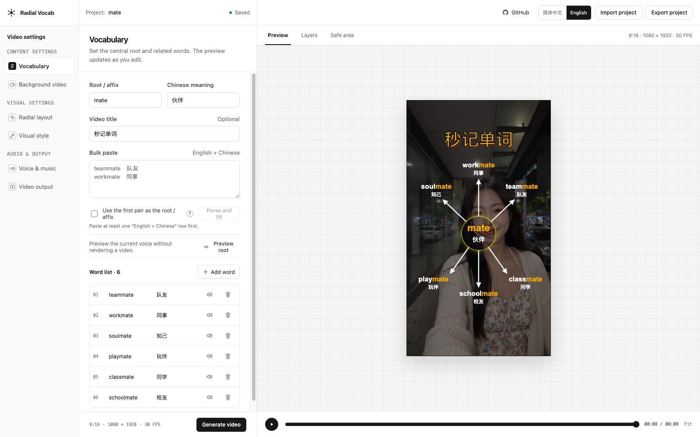

# Radial Vocab Video Studio

English | [简体中文](README.zh.md) | [Live demo](https://radial-vocab-video-studio.pages.dev/) | [GitHub repository](https://github.com/soloshow-labs/radial-vocab-video-studio)

Radial Vocab Video Studio is a local-first editor for turning word roots, affixes, and related vocabulary into narrated radial videos. Edit the content and visual settings in a three-column workspace, preview the composition in real time, and export an MP4 with Azure Speech narration.

[](https://radial-vocab-video-studio.pages.dev/)

*Edit vocabulary content and preview the radial composition in real time. Click the screenshot to try the live demo.*

Maintained by [SoloShow Labs](https://github.com/soloshow-labs).

WeChat Official Account: 一人独角show

## Live demo

Try the static demo at [radial-vocab-video-studio.pages.dev](https://radial-vocab-video-studio.pages.dev/).

The repository includes a static demo build for Cloudflare Pages. The demo supports editing, real-time visual preview, JSON import/export, and browser-local background media preview. Local media never leaves the current browser tab.

Azure Speech preview and MP4 rendering are deliberately disabled in the public demo. Install the project locally for the complete workflow; this keeps API credentials private and prevents a shared public service from consuming your Azure quota.

## Highlights

- Radial word-root layouts with editable positions, arrow lengths, colors, typography, and timing
- 9:16, 16:9, 3:4, and 4:3 output presets
- Background video and background music uploads, with looping, trimming, volume, and fit controls
- Azure Speech voice previews and narrated MP4 rendering, with independent English and Chinese voices
- Live canvas preview plus final video and poster downloads
- Chinese and English interface languages
- Portable JSON project import and export
- Local-only API bound to `127.0.0.1`; credentials never enter the browser or project file

## Requirements

- Node.js 22 or newer
- pnpm 11 or newer
- Google Chrome or Chromium for Remotion rendering
- A Microsoft Azure Speech resource

## Install and run

Clone the project and install its locked dependencies:

```bash
git clone https://github.com/soloshow-labs/radial-vocab-video-studio.git
cd radial-vocab-video-studio
corepack enable
pnpm install --frozen-lockfile
```

To use voice preview and narrated rendering, create a local `.env` file.

macOS or Linux:

```bash
cp .env.example .env
chmod 600 .env
```

Windows PowerShell:

```powershell
Copy-Item .env.example .env
```

Open `.env` and add the key and region from your Azure Speech resource. The editor itself can open without these values, but speech preview and narrated rendering need them.

```dotenv
AZURE_SPEECH_KEY=your-key
AZURE_SPEECH_REGION=your-region
```

Credentials are configured only in this local file; there are no temporary credential fields in the editor. After changing `.env`, restart `pnpm dev`. When Azure Speech is configured, the voice selectors load the current English and Chinese voices from Azure and keep a small built-in fallback list if that lookup is unavailable.

Start both the editor and its local API:

```bash
pnpm dev
```

Open [http://127.0.0.1:5173](http://127.0.0.1:5173). The API listens only on `127.0.0.1:4317` by default.

If Remotion cannot locate Chrome, set its executable explicitly in `.env`:

```dotenv
RADIAL_BROWSER_EXECUTABLE=/absolute/path/to/Chrome
```

## Basic workflow

1. Enter a root or affix, its Chinese meaning, and the related words.
2. Upload an optional background video and background music.
3. Adjust the radial layout, title, colors, timing, voice, and output ratio.
4. Use **Preview root** or the speaker button beside a word to check narration.
5. Select **Generate video**, follow the progress in **Video output**, and download the MP4 or poster.

Uploaded media and generated files are stored under the ignored `storage/` directory. Project JSON exports contain settings only: API credentials, absolute paths, and uploaded media are deliberately excluded. After importing a project on another machine, upload its background media again.

## Configuration

| Variable | Required | Purpose |
| --- | --- | --- |
| `AZURE_SPEECH_KEY` | Yes for preview and rendering | Azure Speech subscription key; read only by the local server |
| `AZURE_SPEECH_REGION` | Yes for preview and rendering | Azure Speech resource region, such as `eastus` |
| `RADIAL_BROWSER_EXECUTABLE` | No | Absolute path to Chrome or Chromium when automatic discovery fails |

Keep `.env` local. It is ignored by Git, while `.env.example` contains placeholders only.

## Development

```bash
pnpm typecheck
pnpm test
pnpm build
pnpm test:render
```

`pnpm test:render` creates a short narrated MP4 using a synthetic test voice. When a system `ffprobe` is available, the script also performs an optional second check of the video and audio streams; the application itself does not require FFmpeg to be installed separately.

The React/Vite editor lives in `src/app` and `src/features`, the Fastify API in `src/server`, shared project types in `src/domain`, and the Remotion composition in `src/remotion`.

To verify the Cloudflare Pages demo build locally:

```bash
pnpm build:demo
pnpm exec vite preview --host 127.0.0.1
```

## Deploy the public demo to Cloudflare Pages

Create a Cloudflare Pages project from this GitHub repository and use:

| Setting | Value |
| --- | --- |
| Production branch | `main` |
| Build command | `pnpm build:demo` |
| Build output directory | `dist` |
| Root directory | `/` |

No Azure credentials or other secrets are required for the static demo. Cloudflare rebuilds the site after changes reach the configured production branch. The checked-in `public/_headers` file applies browser security headers to the deployed site.

## Security

The full server is intended for a trusted, single-user computer. It binds to `127.0.0.1`, rejects foreign browser origins, protects mutations with an ephemeral session token, validates upload type and size, sanitizes file names, and never sends Azure credentials to the client.

The Origin and session-token checks protect against cross-origin browser requests; they are not authentication between programs or operating-system users on the same computer. Do not expose the local API through a network proxy or tunnel, and do not run the full server as a shared multi-user service. For vulnerability reports, see [SECURITY.md](SECURITY.md).

For questions and feature requests, use [GitHub Issues](https://github.com/soloshow-labs/radial-vocab-video-studio/issues) or follow the WeChat Official Account **一人独角show**.

## License

The source code in this repository is MIT licensed © 2026 SoloShow Labs. See [LICENSE](LICENSE).

Runtime dependencies keep their own licenses. In particular, Remotion uses the separate [Remotion License](https://www.remotion.dev/license); review its eligibility and commercial-use terms before using this project. See [THIRD_PARTY_NOTICES.md](THIRD_PARTY_NOTICES.md).
