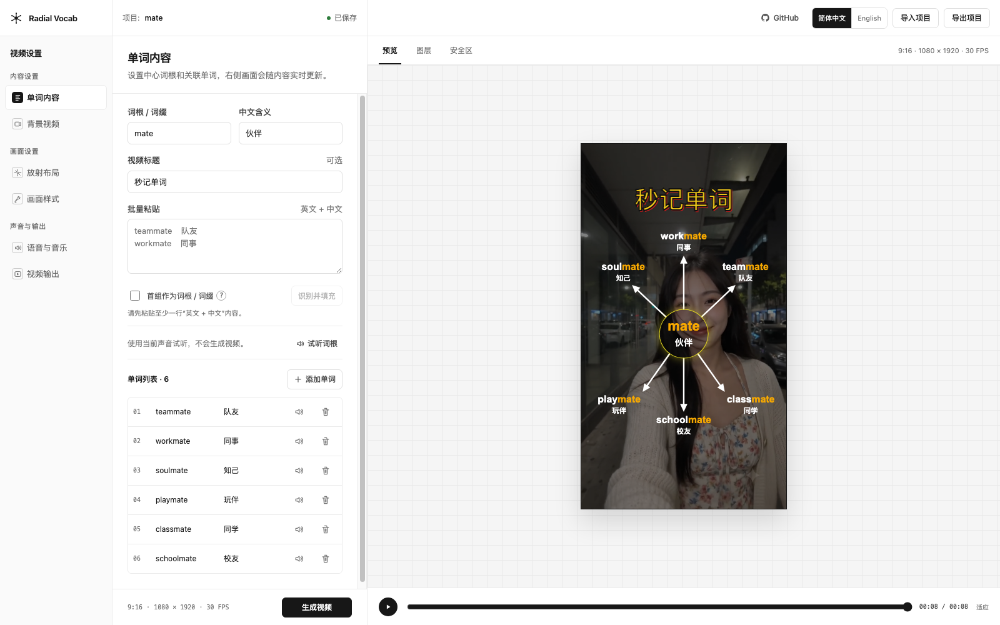

# Radial Vocab Video Studio

[English](README.md) | 简体中文 | [在线体验](https://radial-vocab-video-studio.pages.dev/) | [GitHub 项目](https://github.com/soloshow-labs/radial-vocab-video-studio)

Radial Vocab Video Studio 是一款本地优先的词根放射视频编辑器。你可以在三栏工作区中编辑词根、词缀和关联单词，实时预览画面，并通过 Azure Speech 生成带朗读的 MP4 视频。

[](https://radial-vocab-video-studio.pages.dev/)

*编辑词汇内容并实时预览放射画面。点击截图可进入在线体验版。*

项目由 [SoloShow Labs（一人独角show）](https://github.com/soloshow-labs) 维护。

微信公众号：一人独角show

## 在线体验版

访问 [radial-vocab-video-studio.pages.dev](https://radial-vocab-video-studio.pages.dev/) 即可在线体验静态版本。

仓库提供了适合 Cloudflare Pages 的静态体验版。体验版支持编辑内容、实时预览画面、导入导出 JSON 项目，以及直接在当前浏览器标签页中预览本地背景视频和音乐。本地素材不会上传到服务器。

为了保护 API 密钥并避免公共服务消耗你的 Azure 额度，在线体验版不会连接 Azure Speech，也不提供语音试听和 MP4 生成。需要完整功能时，请按照下面的说明在本地安装运行。

## 主要功能

- 词根放射布局，可调整单词位置、箭头长度、颜色、字体和时间参数
- 支持 9:16、16:9、3:4 和 4:3 输出比例
- 支持上传背景视频和背景音乐，并可设置循环、起始时间、音量和填充方式
- 支持 Azure Speech 语音试听和视频朗读，可分别设置英文和中文声音
- 实时画面预览，生成后可下载 MP4 和预览图
- 支持简体中文和英文界面
- 支持导入、导出不含密钥的 JSON 项目文件
- 本地 API 仅监听 `127.0.0.1`，密钥不会进入浏览器或项目文件

## 环境要求

- Node.js 22 或更高版本
- pnpm 11 或更高版本
- Google Chrome 或 Chromium，用于 Remotion 视频渲染
- 一个 Microsoft Azure Speech 语音服务资源

## 安装与启动

先克隆项目，并安装锁定版本的依赖：

```bash
git clone https://github.com/soloshow-labs/radial-vocab-video-studio.git
cd radial-vocab-video-studio
corepack enable
pnpm install --frozen-lockfile
```

如果需要试听语音或生成带朗读的视频，请创建本地 `.env` 文件。

macOS 或 Linux：

```bash
cp .env.example .env
chmod 600 .env
```

Windows PowerShell：

```powershell
Copy-Item .env.example .env
```

打开 `.env`，填写 Azure Speech 资源的密钥和区域。未填写时仍可打开编辑器，但不能试听语音或生成带朗读的视频。

```dotenv
AZURE_SPEECH_KEY=你的密钥
AZURE_SPEECH_REGION=你的资源区域
```

密钥只在本机的 `.env` 中配置，编辑器不会提供临时密钥输入框。修改 `.env` 后需要重新启动 `pnpm dev`。Azure Speech 配置成功后，声音选择框会动态读取当前可用的英文和中文音色；如果读取失败，仍可使用内置的少量备用音色。

同时启动编辑器和本地 API：

```bash
pnpm dev
```

浏览器访问 [http://127.0.0.1:5173](http://127.0.0.1:5173)。后端默认只监听本机的 `127.0.0.1:4317`。

如果 Remotion 找不到 Chrome，可以在 `.env` 中指定浏览器程序的绝对路径：

```dotenv
RADIAL_BROWSER_EXECUTABLE=/Chrome/程序的绝对路径
```

## 基本使用流程

1. 填写词根或词缀、中文含义和关联单词。
2. 根据需要上传背景视频和背景音乐。
3. 调整放射布局、标题、颜色、时间、朗读声音和输出比例。
4. 使用“试听词根”或单词旁的扬声器按钮检查朗读效果。
5. 点击“生成视频”，在“视频输出”中查看进度，然后下载 MP4 或预览图。

上传的素材和生成结果会保存在已被 Git 忽略的 `storage/` 目录。导出的项目 JSON 只包含设置，不包含 API 密钥、绝对路径或上传的素材。在另一台电脑导入项目后，需要重新上传背景素材。

## 环境变量

| 变量 | 是否必填 | 作用 |
| --- | --- | --- |
| `AZURE_SPEECH_KEY` | 试听和生成视频时必填 | Azure Speech 订阅密钥，仅由本地后端读取 |
| `AZURE_SPEECH_REGION` | 试听和生成视频时必填 | Azure Speech 资源区域，例如 `eastus` |
| `RADIAL_BROWSER_EXECUTABLE` | 可选 | 无法自动找到 Chrome 或 Chromium 时，填写浏览器程序的绝对路径 |

请勿提交 `.env`。它已经被 Git 忽略，仓库中的 `.env.example` 只包含空白占位符。

## 开发与检查

```bash
pnpm typecheck
pnpm test
pnpm build
pnpm test:render
```

`pnpm test:render` 会使用测试语音生成一段短 MP4。如果系统中恰好安装了 `ffprobe`，脚本还会额外检查视频和音频轨道；应用本身不需要单独安装 FFmpeg。

React/Vite 编辑器位于 `src/app` 和 `src/features`，Fastify API 位于 `src/server`，共享项目类型位于 `src/domain`，Remotion 视频组件位于 `src/remotion`。

在本地检查 Cloudflare Pages 体验版：

```bash
pnpm build:demo
pnpm exec vite preview --host 127.0.0.1
```

## 部署到 Cloudflare Pages

在 Cloudflare Pages 中连接这个 GitHub 仓库，并填写以下设置：

| 设置 | 内容 |
| --- | --- |
| 生产分支 | `main` |
| 构建命令 | `pnpm build:demo` |
| 构建输出目录 | `dist` |
| 根目录 | `/` |

静态体验版不需要填写 Azure 密钥或其他 Secret。代码合并到配置好的生产分支后，Cloudflare 会自动重新构建。仓库中的 `public/_headers` 会为线上页面添加浏览器安全响应头。

## 安全说明

完整版后端只适合在可信的个人电脑上使用。它仅监听 `127.0.0.1`，会拒绝来自其他网页来源的请求；所有修改请求都需要临时会话令牌；上传文件会经过类型、大小和文件名检查；Azure 密钥不会返回给前端。

来源检查和会话令牌用于防止其他网页跨站调用，并不能鉴别同一台电脑上的不同程序或系统用户。请勿通过网络代理、端口转发或隧道把本地 API 暴露到局域网或公网，也不要把完整版后端当作多人共享服务。发现安全问题时，请按照 [SECURITY.md](SECURITY.md) 中的方式联系维护者。

如有使用问题或功能建议，可以提交 [GitHub Issue](https://github.com/soloshow-labs/radial-vocab-video-studio/issues)，也可以关注微信公众号 **一人独角show**。

## 开源许可

本仓库自行编写的源码采用 MIT 许可证，© 2026 SoloShow Labs，详见 [LICENSE](LICENSE)。

运行时依赖仍遵循各自的许可证。特别是 Remotion 使用独立的 [Remotion License](https://www.remotion.dev/license)；使用本项目之前，请根据自身情况确认是否符合其免费使用或商业许可条件。详见 [THIRD_PARTY_NOTICES.md](THIRD_PARTY_NOTICES.md)。
